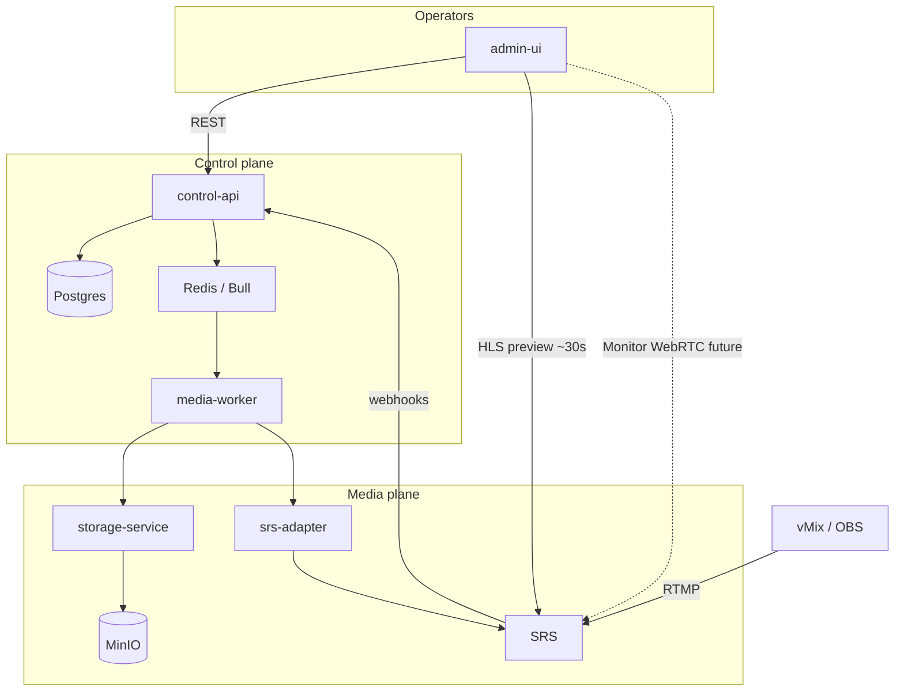

# HydroFoil — Architecture roadmap (post E2E)

**Last updated:** 2026-05-28  
**Context:** Ingest → SRS → route forward → Live Sessions → admin HLS preview is **proven**. This document remodels the system around that reality and sequences what comes next.

---

## Proven end-to-end path (today)

```
vMix / OBS
    │  RTMP publish
    ▼
SRS :1935  app=live  stream=<Input.streamKey>
    │  http_hooks: on_publish / on_unpublish
    │  forward.backend: on_forward (per publish)
    ▼
control-api
    │  LiveSession rows + stream.started / stream.stopped events
    │  Dynamic RTMP forwards from enabled Routes (domain/srs-forward)
    ▼
Postgres (inputs, outputs, routes, gateway_config_versions)
    │
    ├─► media-worker: reconcile-gateway-config (desired state + version rows)
    ├─► srs-adapter: reachability check (runtime forwards = SRS hook, not HTTP apply yet)
    └─► admin-ui: Live Sessions table, detail, HLS preview popup (~30–40s latency)
```

**Playback URLs (operator preview / embed):**

| Path | Role | Latency |
|------|------|---------|
| `/srs-media/live/{key}.m3u8` | Shareable entry (proxied to SRS) | ~30–40s (HLS 10s segments + player buffer) |
| `/live/...` | Required proxy — SRS master playlist uses absolute `/live/` paths | same |
| `http://localhost:8080/live/{key}.flv` | HTTP-FLV (SRS `http_remux`) — not in UI yet | ~2–5s |
| WebRTC (WHEP/WHIP) | **Not built** — target for monitor | ~0.5–2s |

Docker: `admin-ui` must proxy to `http://srs:8080` (`VITE_SRS_PLAYBACK_PROXY`), not `localhost:8080` inside the container.

---

## Remodel: two planes

Split the system mentally (and in code ownership) into **control plane** vs **media plane**.

### Control plane (HydroFoil Core)

**Owns:** business truth in Postgres, operator APIs, desired gateway graph, sessions/assets metadata, job enqueue, plugin policy.

| Component | Responsibility |
|-----------|----------------|
| `control-api` | CRUD, webhooks, gateway orchestration, session sync |
| `packages/domain` | Route resolution, `SRSDesiredConfig`, path templates, forward URL builders |
| `packages/db` | Repositories, migrations, `gateway_config_versions` |
| `packages/events` + Bull | `gateway.reconciliation.required`, `stream.started`, … |
| `admin-ui` | Operations console (not a second source of truth) |

**Rule:** HTTP handlers stay fast — no ffmpeg, no MinIO, no long SRS calls in request path.

### Media plane (SRS + workers)

**Owns:** bytes in motion, segment files, transcode, DVR files, object storage I/O.

| Component | Responsibility |
|-----------|----------------|
| **SRS** | Ingest, HLS, HTTP-FLV remux, dynamic forward at publish, future DVR/transcode |
| `srs-adapter` | *Only* SRS HTTP API client; reconcile when we move beyond hook-only forwards |
| `media-worker` | finalize-recording, audio derivatives, metadata, retention |
| `storage-service` | *Only* MinIO/S3 SDK usage |
| **Remote agents** (future) | Scoped recorders outside the cluster |

**Rule:** Plugins and UI never call SRS or MinIO directly — only through adapter / storage-service facades.

---

## Playback: three intentional modes (remodel)

Do **not** use one player for everything. Three products, three latency budgets:

| Mode | User | Transport | Latency target | Status |
|------|--------|-----------|----------------|--------|
| **Embed / public watch** | Site visitors, iframe | HLS (CDN-friendly) | 15–45s (tunable `hls_fragment`) | Popup + copy link/embed |
| **Operator preview** | Admin checking “is it up?” | HLS (current popup) | ~30–40s OK | **Done** (popup) |
| **Monitor live** | Control room, talent comms | **WebRTC (WHEP)** preferred; HTTP-FLV fallback | **&lt; 2s** | **Available in admin UI** |

### Monitor live stream (low latency)

HydroFoil includes a dedicated **“Monitor”** action (separate from the HLS preview popup) optimized for **lowest latency**, not embed-friendliness.

**Recommended approach (in order):**

1. **WebRTC playout (SRS → WHEP)** — Sub-second to ~2s; best for “control room” monitoring. Implemented in the admin monitor modal with `RTCPeerConnection` + SRS WHEP endpoint per stream/session.
2. **HTTP-FLV + mpegts.js / flv.js** — Intermediate fallback (~2–5s); SRS exposes `.flv` via `http_remux` and the admin UI proxies it through `/srs-media`.
3. Keep **HLS popup** for share/embed and “good enough” checks.

**Not** the same as lowering HLS `hls_fragment` alone — that trades latency for stability and still won’t match WebRTC for talkback-style monitoring.

**Core should store (later):** `playbackMode` hints on session or output — `embed_hls` | `monitor_webrtc` | `monitor_flv` — so UI and signed URLs stay policy-driven.

### HydroFoil Player (planned product)

**Today:** `apps/admin-ui/src/components/HlsPlayer.tsx` — thin **hls.js** wrapper inside preview modals (`StreamPreviewModal`). Row toolbars use **`StreamMediaActions`** (Play, Embed, Copy HLS link) on Inputs, Live Sessions, Restreaming, and Recordings (play/share disabled until VOD URLs exist).

**Target:** a first-party **HydroFoil Player** component (and optional embed SDK):

| Capability | Notes |
|------------|--------|
| Branded chrome | Logo, title, quality badge, offline state |
| Embed SDK | Stable iframe/snippet from `StreamMediaActions` embed copy |
| Mode switch | HLS (embed/public), HTTP-FLV or WebRTC (monitor), MP4/HLS VOD (recordings) |
| Signed URLs | Policy-driven playback from `storage-service` |
| Shared package | `@hydrofoil/player` consumable outside admin-ui |

Until the shared player package grows monitor modes, operator preview = HLS popup and low-latency monitor = admin-only WHEP/FLV modal.

---

## Gateway model (current hybrid → target)

### Today (works)

| Mechanism | What it does |
|-----------|----------------|
| `config/srs/srs.conf` | Static `http_hooks` + `forward.backend` URL |
| `POST /api/webhooks/srs` | `on_publish` / `on_unpublish` → LiveSession |
| `POST /api/webhooks/srs/forward` | Returns RTMP forward list from enabled routes at publish time |
| `GET /api/live-sessions` + sync | Backup session list from SRS API if hooks miss |
| `reconcile-gateway-config` job | Persists `SRSDesiredConfig` + version hash; adapter confirms SRS up |

Forwards are **event-driven at publish**, not fully pushed via SRS HTTP API on every route edit (route edits still update desired state for audit and future apply).

### Target (next gateway milestones)

1. **Route change → forward refresh** — On reconcile, optionally kick active publishes to reload forwards (SRS API or republish hint).
2. **DVR / transcode** — `stream_profiles.gateway_mapping` → srs-adapter applies vhost fragments (or documented srs.conf templates).
3. **Single adapter entry** — All SRS HTTP writes go through `srs-adapter`; control-api only receives webhooks and enqueues jobs.

---

## Phased build order (after E2E)

Aligned with [CHECKLIST.md](./CHECKLIST.md). Priority assumes routing + live sessions stay stable.

### Track A — Operator UX (short)

- [x] Live session list + row actions (play, copy link, embed) via `StreamMediaActions`
- [x] Shared row toolbar (`StreamMediaActions`) on Inputs, Live Sessions, Restreaming; Recordings (VOD pending)
- [x] HLS preview popup + `/live` + `/srs-media` proxies
- [x] Auto watch output + route on input create; copy HLS on Inputs
- [x] Delete stream keys with route reassign / delete-routes dialog
- [ ] **Restreaming routes** — merge Outputs + Routes UI; external RTMP/SRT ([RESTREAMING_ROUTES.md](./RESTREAMING_ROUTES.md))
- [ ] Session detail: full policy editors (not just placeholders)
- [x] **Monitor live** — WebRTC or FLV panel

### Track A2 — SRT & multichannel (planned)

- [ ] SRS `srt_server` + input ingest `srt` ([RESTREAMING_ROUTES.md](./RESTREAMING_ROUTES.md) Phase R2)
- [ ] Per-destination egress: **SRT push** (vMix) vs **HLS** (browser) on restream rows
- [ ] vMix 8ch → language pairs via separate inputs **or** FFmpeg channel-split worker (Phase R4)

### Track B — Policies & assets (medium)

- [ ] CRUD: `stream_profiles`, `recording_policies`, `audio_feed_profiles`
- [ ] Wire policies to inputs/outputs on session detail
- [ ] `storage-service` → MinIO browse + signed URLs; Storage page
- [ ] DVR: SRS record → `recording.finalized` → `finalize-recording` → `RecordingAsset`

### Track C — Gateway hardening (medium)

- [ ] Gateway reconciliation tests (idempotent version rows)
- [ ] srs-adapter: apply non-forward runtime (DVR paths, transcode) from `SRSDesiredConfig`
- [ ] Production Dockerfiles for control-api + media-worker (not only admin-ui nginx)

### Track D — Plugins (longer)

Official plugins under `plugins/` per [ARCHITECTURE.md](../ARCHITECTURE.md) — DVR, cloud, republisher, audio, DRM. Each: policy + event + job only.

---

## Data flow (target steady state)



---

## Docs map

| Doc | Use when |
|-----|----------|
| [ARCHITECTURE.md](../ARCHITECTURE.md) | Layer rules, domain model, plugin security, technology stack |
| **This file** | What works now, playback modes, phased priorities |
| [RESTREAMING_ROUTES.md](./RESTREAMING_ROUTES.md) | Restreaming UI/API sketch, external RTMP/SRT, SRT→HLS vs SRT→SRT |
| [BOOKMARK.md](./BOOKMARK.md) | Session resume, docker gotchas, quick file index |
| [CHECKLIST.md](./CHECKLIST.md) | Phase checkboxes |

When resuming implementation: **“Continue from `docs/ARCHITECTURE_ROADMAP.md` Track A/B.”**
