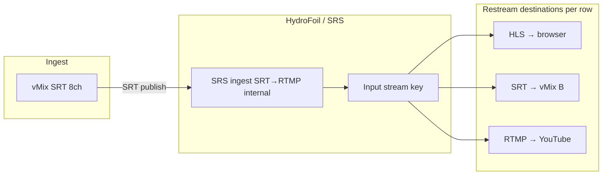
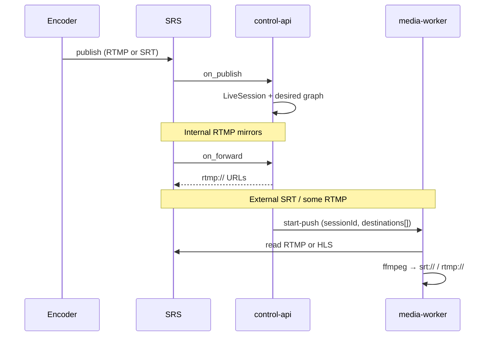

# Restreaming routes — design sketch

**Status:** Plan / not implemented  
**Last updated:** 2026-05-28  
**Related:** [ARCHITECTURE_ROADMAP.md](./ARCHITECTURE_ROADMAP.md), [BOOKMARK.md](./BOOKMARK.md)

---

## Goal

Replace the separate **Outputs** and **Routes** admin tabs with one operator surface: **Restreaming routes**.

> **From this stream key → send a copy to…**

Each row is one destination. Destinations differ by **protocol** and **consumer**:

| Consumer | Typical delivery | Operator copies |
|----------|------------------|-----------------|
| **Browser / embed** | HLS (or DASH later) | `https://…/app/stream.m3u8` |
| **Another vMix / encoder** | SRT or RTMP push | `srt://host:port?…` or `rtmp://…` |
| **Social / CDN ingest** | RTMP push | `rtmp://a.rtmp.youtube.com/…` |

**SRT ingest** (vMix 4–8ch, etc.) is a separate track: enable SRS SRT server, then treat each published path like today’s RTMP inputs. **Routing** from that ingest can target **SRT out** (next vMix) or **HLS** (browser) per destination row—not one global choice.

---

## Mental model (today vs target)

### Today (3 concepts)

```
Input (stream key)
    └── Route ──► Output[] (gateway app/stream + playback_protocol)
                      └── SRS on_forward → RTMP URLs (same host only)
```

- **Watch path:** auto-created Output + Route on input create (`Watch: {app}/{streamKey}`), same SRS path as ingest; forwards to self are filtered out.
- **Manual:** operator creates Output + Route for mirrors (e.g. `live/key` → `GTCH/EN`).

### Target (1 operator concept, 2 internal layers)

```
Input (source)
    └── RestreamDestination[]   ← UI + API name
            ├── kind: local_watch | external_push
            ├── delivery: hls | rtmp | srt
            └── target: URL or gateway app/stream
```

Internally we can keep `outputs` + `routes` tables through Phase 1 and **project** them as restream rows in the UI. Phase 2 collapses to a single table if warranted.

---

## Destination kinds

| Kind | `delivery` | Target shape | Who runs it | Status |
|------|------------|--------------|-------------|--------|
| **Local watch** | `hls` (default), `http-flv` | Same SRS `/{app}/{streamKey}` | SRS remux (no forward) | ✅ auto on input create |
| **Local mirror** | `rtmp` (internal) | Other SRS `/{app}/{stream}` on same cluster | SRS `on_forward` hook | ✅ partial (same-host RTMP only) |
| **External RTMP** | `rtmp` | Full URL `rtmp://host:1935/app/stream` | SRS forward **or** FFmpeg worker | 📋 planned |
| **External SRT** | `srt` | `srt://host:port` + streamid / passphrase | FFmpeg / media-worker | 📋 planned |

### SRT ingest → SRT **or** HLS (your requirement)

Ingest protocol and egress delivery are **independent**:



| Route row | Use case | Egress |
|-----------|----------|--------|
| Watch (built-in) | Public site, admin preview | **HLS** on same path |
| Restream #1 | Downstream vMix | **SRT push** (or RTMP if caller prefers) |
| Restream #2 | Backup encoder | **SRT** or **RTMP** |
| Restream #3 | Social | **RTMP** |

**Not** “one SRT input globally becomes SRT or HLS”—each **destination row** picks `delivery`.

---

## Data model (proposed)

### Phase 1 — View model over existing tables (no migration)

Map DB rows → `RestreamRoute` DTO for API/UI:

```typescript
interface RestreamRoute {
  id: string;                    // route id (primary handle)
  name: string;
  inputId: string;
  enabled: boolean;

  destinations: RestreamDestination[];
}

interface RestreamDestination {
  id: string;                    // output id
  name: string;
  enabled: boolean;
  kind: 'local_watch' | 'local_mirror' | 'external';

  /** What the operator consumes */
  delivery: 'hls' | 'http-flv' | 'rtmp' | 'srt';

  /** Display + copy */
  copyUrl: string;               // HLS page URL, rtmp://, srt://
  routeTarget: string;           // legacy playback path / label

  /** Internal / gateway */
  gatewayApp?: string;
  gatewayStream?: string;
  externalUrl?: string;          // full push URL when kind=external

  isSystem: boolean;             // true = auto "Watch" row (no delete)
}
```

**Rules:**

- One **system** destination per input: `local_watch` + `hls` (current auto output).
- Operator-added rows: `external` + `rtmp` | `srt`, or `local_mirror` + internal app/stream.
- One route per input can hold **multiple** `output_ids` (today) → UI still shows **one row per destination** for clarity (flatten in API).

### Phase 2 — Optional `restream_destinations` table

```sql
CREATE TABLE restream_destinations (
  id UUID PRIMARY KEY,
  organization_id UUID NOT NULL,
  input_id UUID NOT NULL REFERENCES inputs(id) ON DELETE CASCADE,
  name VARCHAR(255) NOT NULL,
  enabled BOOLEAN DEFAULT true,
  kind VARCHAR(32) NOT NULL,          -- local_watch | local_mirror | external
  delivery VARCHAR(32) NOT NULL,        -- hls | http-flv | rtmp | srt
  -- local mirror / watch
  gateway_app_name VARCHAR(255),
  gateway_stream_name VARCHAR(255),
  -- external push
  push_url TEXT,                      -- rtmp:// or srt:// (secrets in vault later)
  srt_streamid VARCHAR(512),
  srt_passphrase TEXT,
  stream_profile_id UUID,
  created_at TIMESTAMPTZ DEFAULT now(),
  updated_at TIMESTAMPTZ DEFAULT now(),
  UNIQUE (organization_id, input_id, name)
);
```

Migrate: collapse auto watch output+route into one `local_watch` row; map old outputs/routes into `external` / `local_mirror`.

---

## Execution plane (how bytes move)

| delivery | Mechanism | Component | Notes |
|----------|-----------|-----------|--------|
| **hls** / **http-flv** | SRS remux on ingest path | SRS | No forward; copy URL only |
| **rtmp** (internal) | SRS dynamic forward at publish | `POST /api/webhooks/srs/forward` | Extend `buildForwardRtmpUrls` to allow **external** hosts |
| **rtmp** (external) | SRS forward if URL allowed, else **FFmpeg push** | control-api hook or **media-worker** | YouTube, Facebook, second SRS |
| **srt** (external) | **FFmpeg** (SRS does not reliably RTMP→SRT) | **media-worker** job per active session | Pull HLS/RTMP from SRS → push SRT |



**Worker job shape (sketch):**

```typescript
interface StartRestreamPushJob {
  sessionId: string;
  inputId: string;
  sourceUrl: string;           // rtmp://127.0.0.1:1935/{app}/{key}
  destinations: Array<{
    destinationId: string;
    delivery: 'rtmp' | 'srt';
    pushUrl: string;
    ffmpegOptions?: Record<string, string>;
  }>;
}
```

Stop job on `on_unpublish` / session idle.

---

## API sketch

### List (merged UI)

```
GET /api/inputs/:inputId/restreams
→ { input, items: RestreamDestination[] }
```

### Create external destination

```
POST /api/inputs/:inputId/restreams
{
  "name": "vMix downstream",
  "delivery": "srt",
  "pushUrl": "srt://192.168.1.50:10080",
  "srtStreamId": "#!::r=live/key,m=publish",
  "enabled": true
}
```

Backend:

1. Create `output` (or `restream_destinations` row) with metadata.
2. Ensure route exists: `input` → `[..., newOutputId]` (single route per input **or** one route per destination—prefer **one route per input** with multiple outputs for simpler graph).

### Delete / toggle

```
PATCH /api/restreams/:id   { enabled }
DELETE /api/restreams/:id  (forbidden if isSystem watch row)
```

---

## Admin UI sketch

**Nav:** replace **Outputs** + **Routes** with **Restreaming**.

**Page layout:**

1. **Filter:** application / input (optional).
2. **Table or cards** grouped by input:

| Source | Destination | Delivery | Copy | On | Actions |
|--------|-------------|----------|------|----|---------|
| `live/en-xu4q46` | Watch (built-in) | HLS | 🔗 | ✓ | — |
| `live/en-xu4q46` | vMix B | SRT | 🔗 | ✓ | ✎ 🗑 |
| `live/en-xu4q46` | YouTube | RTMP | 🔗 | ✓ | ✎ 🗑 |

3. **Add restream** modal:
   - Source: fixed (current input) or picker.
   - **Delivery:** HLS watch (info only) | RTMP push | SRT push.
   - **Target:** URL field + validation + “test connection” (later).
   - For SRT: host, port, streamid, latency, passphrase.

**Inputs page** (keep): ingest URL + **copy watch (HLS)** — already added; restreams link → filtered Restreaming view for that input.

---

## SRT / multichannel (planned, not Phase 1)

| Scenario | Approach | Track |
|----------|----------|-------|
| vMix → **one SRT** per language | One Input per vMix output; each gets watch HLS + restream rows | **A** (ingest + UI) |
| vMix → **one SRT, 8 audio ch** | Input + `channel_map` → worker splits → child inputs | **B** (audio) |
| Restream → vMix | `delivery: srt` row | **A** (worker push) |
| Restream → browser | `delivery: hls` (watch row) | ✅ |

---

## Phased implementation

### Phase R1 — UI + API projection (no worker)

- [x] `GET /api/restreams` + `GET /api/restreams/inputs/:id` DTO from outputs/routes.
- [x] Admin nav: **Restreaming**; `/outputs` and `/routes` redirect.
- [x] CRUD for **external RTMP** + **local SRS mirror** via `POST /api/restreams/inputs/:id`.
- [x] External `rtmp://` URLs passed through SRS forward hook (`resolveForwardRtmpUrl`).
- [x] System watch rows (`Watch:` prefix) — not deletable; shown as built-in HLS.

### Phase R2 — SRT ingest + SRT egress worker

- [ ] `srt_server` in `config/srs/srs.conf`; vhost `srt { enabled on; srt_to_rtmp on; }`.
- [ ] Input `ingestProtocol: srt` + docs for vMix URL.
- [ ] `media-worker`: `start-restream-push` / `stop-restream-push` on publish/unpublish.
- [ ] Restream UI: **SRT push** destination type.

### Phase R3 — Model cleanup

- [ ] Migration `restream_destinations` (optional).
- [ ] Drop separate Outputs/Routes CRUD routes; single restream API.
- [ ] Secrets: store passphrases in env/vault reference, not plain DB.

### Phase R4 — Audio channel split

- [ ] `audio_channel_map` on input; worker → N child streams; restream per language.

---

## Security / ops notes

- **Validate push URLs** — org-scoped allowlist (no random internet relay) or signed operator role.
- **Never log** SRT passphrases / RTMP stream keys in webhook logs.
- **Idempotent jobs** — one worker per `(sessionId, destinationId)`; restart on reconcile.
- **Forward vs worker** — prefer SRS forward for RTMP when possible (lower latency); FFmpeg for SRT and picky CDNs.

---

## Compatibility with current code

| Piece | Change |
|-------|--------|
| `provisionDefaultInputPlayback` | Becomes `kind: local_watch`; hidden from “Add restream” |
| `DeleteInputDialog` | Also removes external destinations (already via route outputs teardown) |
| `SRSDesiredConfig` | Add `externalPush: { delivery, url }[]` per ingest alongside `forwards` |
| `srs-forward.ts` | Split **internal** vs **external** RTMP; filter self-forward (done) |

---

## Open decisions

1. **One route per input vs one route per destination** — Recommend **one route, many outputs** until Phase 2 migration.
2. **SRS forward to public RTMP** — Test SRS 5 behavior with full URLs; fallback to worker if unsupported.
3. **HLS as restream row** — Watch row is read-only HLS; external “HLS” would mean pull from another origin (unusual); skip unless needed.

---

## Resume prompt

> “Implement Restreaming Phase R1 from `docs/RESTREAMING_ROUTES.md`.”
